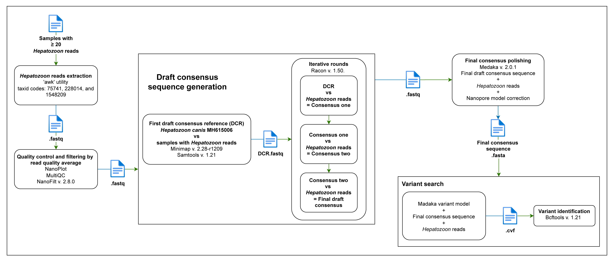

# Nanopore 18S rRNA Amplicon-Based Sequencing Workflow

This repository contains a complete and modular bioinformatics pipeline for processing Oxford Nanopore amplicon sequencing data, particularly targeting the 18S rRNA gene of arthropod-transmitted hemoparasites. The pipeline includes scripts for quality filtering, adapter and primer removal, taxonomic classification, and validation of unclassified reads.

## Overview of the Workflow


*Figure S2. General bioinformatics workflow for processing nanopore amplicon reads.*

---

## 1. Basecalling, Demultiplexing, and Concatenation

* **Tool**: Guppy v4.2.2 (SUP model)
* **Input**: Raw `fast5` files
* **Output**: `fastq` files with Q-score ≥10 and barcodes at both ends
* **Concatenation**: `02-concat_fastq.sh`

```bash
bash 02-concat_fastq.sh -i <demux_dir> -o <concat_output>
```

---

## 2. First Quality Evaluation

* **Tool**: NanoPlot v1.42.0
* **Script**: `03-nanoplot_fastq_processor.sh`

```bash
bash 03-nanoplot_fastq_processor.sh -i <concat_fastq> -o <qc_nanoplot1>
```

---

## 3. Adapter and Chimera Removal

* **Tool**: Porechop v0.2.4
* **Script**: `04-porechop_fastq_processor.sh`

```bash
bash 04-porechop_fastq_processor.sh -i <qc_input> -o <porechop_output>
```

---

## 4. Length Filtering

* **Tool**: fastp v0.23.4
* **Range**: 577–831 bp
* **Script**: `05-fastp_fastq_processor.sh`

```bash
bash 05-fastp_fastq_processor.sh -i <input> -o <output> -r 577 -l 831
```

---

## 5. Primer Removal

* **Tool**: Cutadapt v3.3
* **Script**: `06_cutadapt_subdir_fastq_processor.sh`
* **Options**: `--rc`, `--times 6`, `-e 0.25`

```bash
bash 06_cutadapt_subdir_fastq_processor.sh -i <filtered_input> -o <trimmed_output>
```

---

## 6. Second Quality Evaluation

* **Tool**: NanoPlot v1.42.0
* **Script**: `07_nanoplot_fastq_processor_2.sh`

```bash
bash 07_nanoplot_fastq_processor_2.sh -i <trimmed_fastq_dir> -o <qc_nanoplot2>
```

---

## 7. MultiQC Summary (Run Twice)

* **Tool**: MultiQC v1.24.1
* **Script**: `multiqc_report.sh`

```bash
bash multiqc_report.sh -i <nanoplot_dir> -o <multiqc_output>
```

---

## 8. Taxonomic Classification

* **Tool**: Kraken2 v2.0.9
* **Database**: SILVA Ref NR 138.2
* **Script**: `08-kraken2_fastq_classifier.sh`
* **Options**: `--confidence 0.1`, `--minimum-hit-groups 4`

```bash
bash 08-kraken2_fastq_classifier.sh -i <trimmed_fastq> -o <kraken_output> -d <kraken_db>
```

---

## 9. Validation of Unclassified Reads

* **Tool**: MEGABLAST (BLASTn)
* **Script**: `megablast.sh`
* **Database**: `core_nt.00`
* **Thresholds**: ≥95% identity, ≥98% coverage, bitscore ≥50, E ≤0, Δbitscore ≥32

```bash
bash megablast.sh -i <fasta_unclassified> -o <blast_output>
```

---

## Figures and Supplementary Information

* `Fig_S2.png`: General pipeline overview
* `Fig_S3.png`: Consensus sequence generation and variant analysis

*Sections corresponding to 2.4.3 and 2.4.4 will be integrated in the next phase of documentation.*
