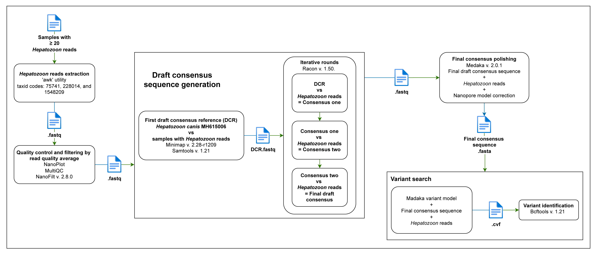

# Nanopore 18S rRNA Amplicon-Based Sequencing Workflow

This repository contains a complete and modular bioinformatics pipeline for processing Oxford Nanopore 18S rRNA amplicon sequencing data, particularly for detecting arthropod-transmitted hemoparasites. The pipeline includes scripts for quality filtering, adapter and primer removal, taxonomic classification, and validation of unclassified reads.

  
*Figure 1. Bioinformatics pipeline for nanopore amplicon-based sequencing analysis. The process begins with basecalling and demultiplexing. The green dashed box highlights the source file (.fast5), while green arrows represent input files, and blue arrows indicate output files. Orange boxes are output files from one step and input for subsequent steps. Green dashed lines denote the reuse of generated files as inputs in subsequent steps. Blue boxes enclose the final output files.*

---

## Data processing and quality filtering

---

## 1. Basecalling and Demultiplexing

- **Script:** `01_basecalling_and_demultiplexing.sh`  
- **Tools:** Guppy v4.2.2  
- **Description:** Performs basecalling using the Super Accuracy (SUP) model and demultiplexing via Guppy. Retains only reads with barcodes at both ends.

```bash
bash 01_basecalling_and_demultiplexing.sh \
  -i 08-raw_fast5/ \
  -o 07-guppy_output/ \
  -m ~/ont-guppy/data/dna_r10.4.1_e8.2_400bps_sup@v5.0.0/ \
  -b SQK-NBD114-96
```

**Expected structure:**
```
07-guppy_output/
├── basecalled/
│   └── pass/*.fastq
├── demultiplexed/
│   ├── barcode01/*.fastq
│   └── barcode02/*.fastq
```

---

## 2. Concatenation of FASTQ Files

- **Script:** `02-concat_fastq.sh`  
- **Description:** Concatenates all `.fastq` files from each barcode directory into one `.fastq` file per barcode.

```bash
bash 02-concat_fastq.sh -i /path/to/demultiplexing_fastq/ -o /path/to/output
```

---

## 3. First Quality Evaluation

- **Tool:** NanoPlot v1.42.0  
- **Script:** `03-nanoplot_fastq_processor.sh`  
- **Description:** Generate an initial quality control report on the concatenated `.fastq` files using NanoPlot.

```bash
bash 03-nanoplot_fastq_processor.sh -i <concat_fastq> -o <qc_nanoplot1>
```

---

## 4. First MultiQC Summary

- **Tool:** MultiQC v1.24.1  
- **Script:** `multiqc_report.sh`  
- **Description:** Aggregate initial quality control reports (e.g., from NanoPlot) into a single interactive summary using MultiQC.  
  *This step helps evaluate read quality prior to adapter and primer removal.*

```bash
bash multiqc_report.sh -i <qc_nanoplot1> -o <multiqc_output1>
```

---

## 5. Adapter and Chimera Removal

- **Tool:** Porechop v0.2.4  
- **Script:** `04-porechop_fastq_processor.sh`  
- **Description:** Trim adapter sequences and remove chimeric reads from the input `.fastq` files using Porechop.

```bash
bash 04-porechop_fastq_processor.sh -i <qc_input> -o <porechop_output>
```

---

## 6. Length Filtering

- **Tool:** fastp v0.23.4  
- **Range:** 577–831 bp (adjustable)  
- **Script:** `05-fastp_fastq_processor.sh`  
- **Description:** Filter reads based on length using `fastp`, retaining only those within a specified range (e.g., between 577 and 831 base pairs). These thresholds can be adjusted depending on the target amplicon size.  
  **Input files** must correspond to the output of the previous step (i.e., Porechop-trimmed and chimera-free `.fastq` files).

```bash
bash 05-fastp_fastq_processor.sh -i <input> -o <output> -r 577 -l 831
```

---

## 7. Primer Removal

- **Tool:** Cutadapt v3.3  
- **Script:** `06_cutadapt_subdir_fastq_processor.sh`  
- **Options:** `--rc`, `--times 6`, `-e 0.25`  
- **Description:** Remove **PCR primer sequences** from both ends and within the reads using Cutadapt. The script allows up to 6 removal attempts per read (`--times 6`), supports reverse complements (`--rc`), and tolerates up to 25% sequence mismatch (`-e 0.25`).

```bash
bash 06_cutadapt_subdir_fastq_processor.sh -i <filtered_input> -o <trimmed_output>
```

---

## 8. Second Quality Evaluation

- **Tool:** NanoPlot v1.42.0  
- **Script:** `07_nanoplot_fastq_processor_2.sh`  
- **Description:** Re-evaluate the quality of the reads after adapter trimming, length filtering, and primer removal with NanoPlot.

```bash
bash 07_nanoplot_fastq_processor_2.sh -i <trimmed_fastq_dir> -o <qc_nanoplot2>
```

---

## 9. Second MultiQC Summary

- **Tool:** MultiQC v1.24.1  
- **Script:** `multiqc_report.sh`  
- **Description:** Aggregate post-processing quality control reports into a single summary using MultiQC.  
  *This step summarizes the quality of cleaned reads before classification.*

```bash
bash multiqc_report.sh -i <qc_nanoplot2> -o <multiqc_output2>
```

---

## Taxonomic analysis and genetic characterization

---

## 10. Taxonomic Classification

- **Tool:** Kraken2 v2.0.9  
- **Database:** SILVA Ref NR 138.2  
- **Script:** `08-kraken2_fastq_classifier.sh`
- **Description:** Classify reads taxonomically using Kraken2 against the SILVA database, with confidence and hit-group thresholds for accuracy.  
- **Options:** `--confidence 0.1`, `--minimum-hit-groups 4`


```bash
bash 08-kraken2_fastq_classifier.sh -i <trimmed_fastq> -o <kraken_output> -d <kraken_db>
```

---

## 11. Conversion of Unclassified FASTQ to FASTA

- **Script:** `fastq_to_fasta.sh`  
- **Tool:** seqkit (required)  
- **Description:** Convert `.fastq` files containing unclassified reads (from Kraken2) to `.fasta` format prior to MEGABLAST validation. Only valid, non-empty files are processed, and read headers are simplified (e.g., extracting only `read=XXXX`). A log of skipped files is also generated.

```bash
bash fastq_to_fasta.sh -i <unclassified_fastq_dir> -o <fasta_output_dir>
```

---

## 12. Validation of Unclassified Reads

- **Tool:** MEGABLAST (BLAST)  
- **Script:** `megablast.sh`
- **Description:** Validate Kraken2-unclassified reads using a high-stringency BLAST (MEGABLAST) search against a curated nucleotide database to identify potential taxonomic matches that were missed during the initial classification.  
- **Database:** `core_nt.00`  
- **Thresholds:** ≥95% identity, ≥98% coverage, bitscore ≥50, E ≤0, Δbitscore ≥32

```bash
bash megablast.sh -i <fasta_unclassified> -o <blast_output>
```

---

## Consensus sequence generation and variant identification

  
*Figure 2. Workflow for consensus sequence generation and genetic variant identification for Hepatozoon reads obtained through nanopore amplicon-based sequencing. The green arrows represent input files, while the blue line after each box indicates output files. Each box outlines the specific tools and input/output file formats used at each step, illustrating the logical and modular structure of the process.*

---

## 13. Extraction and Threshold Filtering of Taxon-Specific Reads

- **Script:** `awk_fastq_filter.sh`  
- **Tool:** AWK, Bash  
- **Description:** Extracts `.fastq` reads assigned to specific taxonomic identifiers (e.g., `taxid|XXXX`) based on Kraken2 annotations. Each input file is evaluated for the number of taxon-matched reads. If the count exceeds the defined threshold, the output is saved as `*_above_threshold.fastq`; otherwise, it is saved separately as `*_below_threshold.fastq`.

```bash
bash awk_fastq_filter.sh -i <input_fastq_dir> -o <output_dir> -c <taxid1,taxid2,...> -n <read_threshold>
```

## 14. Quality Evaluation of Extracted Reads

- **Script:** `03-nanoplot_fastq_processor.sh`  
- **Tool:** NanoPlot v1.42.0  
- **Description:** Generates per-sample quality control metrics for taxon-specific `.fastq` files using NanoPlot. Output includes read length distributions, quality score histograms, and summary statistics in TSV format. Results are used to determine appropriate Q-score thresholds for downstream filtering (e.g., NanoFilt).

```bash
bash 03-nanoplot_fastq_processor.sh -i <filtered_fastq_dir> -o <qc_output_dir>
```

## 15. MultiQC Summary of Extracted Read Quality

- **Script:** `multiqc_report.sh`  
- **Tool:** MultiQC v1.24.1  
- **Description:** Aggregates all NanoPlot results from the extracted `.fastq` reads into a single interactive summary report. This facilitates comparison of read quality metrics across samples and helps determine appropriate filtering thresholds (e.g., for Q-score cutoff in NanoFilt).

```bash
bash multiqc_report.sh -i <nanoplot_results_dir> -o <multiqc_output_dir>
```

## 16. Quality Filtering with NanoFilt

- **Script:** `nanofilt_fastq_filter.sh`  
- **Tool:** NanoFilt v2.8.0  
- **Description:** Filters `.fastq` files based on average read quality using NanoFilt. Only files with a user-defined minimum number of high-quality reads are retained. This step helps eliminate low-quality data before alignment and consensus generation.

```bash
bash nanofilt_fastq_filter.sh -i <input_fastq_dir> -o <filtered_output_dir> -n <min_reads> -q <quality_threshold>
```

## 17. Consensus Sequence Generation and Polishing

- **Script:** `consensus_polishing.sh`  
- **Tools:** Minimap2 v2.28, Samtools v1.21, Racon v1.5.0, Medaka v2.0.1  
- **Description:** Performs iterative consensus sequence generation from filtered reads. Initial mapping and error correction are done with Racon over three iterations, followed by final polishing with Medaka using a neural network model for Nanopore data. Processed samples are named using the `barcodeXX` convention, and final consensus sequences are stored in a user-defined directory.

```bash
bash consensus_polishing.sh \
  -i <filtered_fastq_dir> \
  -o <intermediate_output_dir> \
  -r <reference_fasta_dir> \
  -c <final_consensus_output_dir>
```

---

## Figures and Supplementary Information

- `Fig_1.png`: General pipeline overview  
- `Fig_2.png`: Consensus sequence generation and variant analysis  

*Sections corresponding to 2.4.3 and 2.4.4 will be integrated in the next phase of documentation.*
